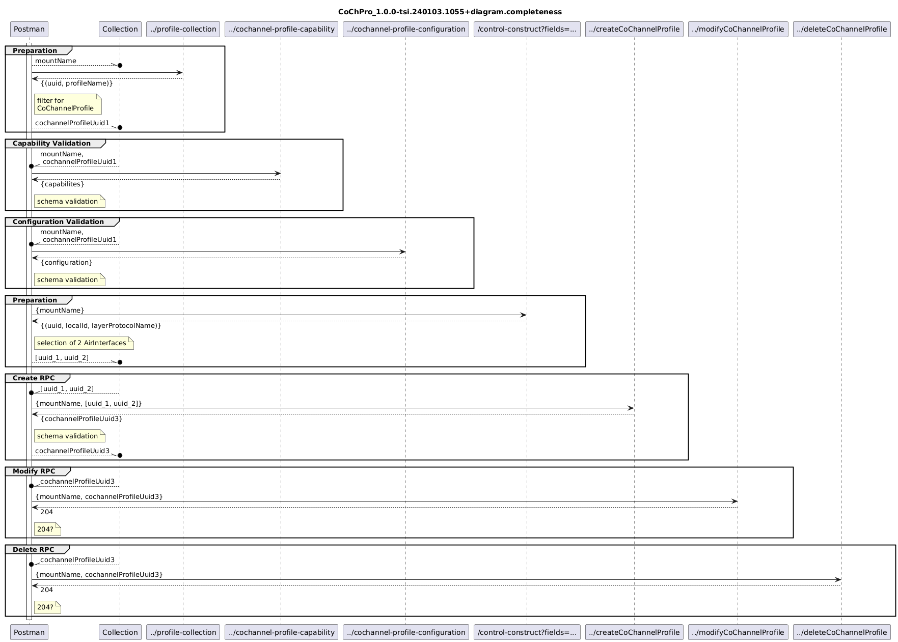

# CoChannelProfile_1.0.0-tsi.240103.1055+validator

### Completeness
- [CoChPro_1.0.0-tsi.240103.1055+validator.completeness](./Completeness/CoChPro_1.0.0-tsi.240103.1055+validator.completeness.json)  
- [CoChPro_1.0.0-tsi.240103.1055+data.completeness](./Completeness/CoChPro_1.0.0-tsi.240103.1055+data.completeness.json)  
-   